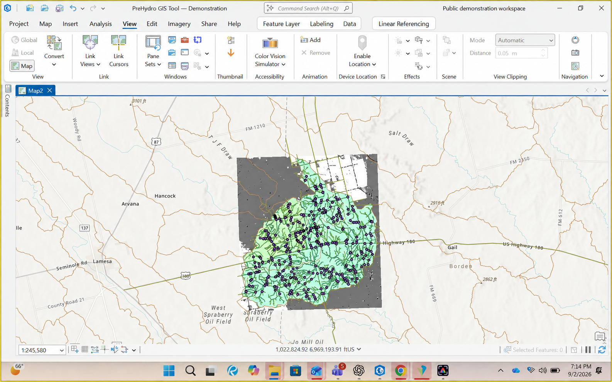

# Mine Water & Infrastructure Resilience — QGIS 1.0

An installable QGIS Processing plugin for auditable mine-water and infrastructure screening.
It is built on the PreHydro GIS Tool 4.2 global engine and adds mine-specific catchments,
runoff-volume screening, drainage/transport crossing ranking, facility proximity,
monitoring/receptor preservation, CSV tables, HTML reporting, and JSON provenance.



## What this is useful for

This is for the first engineering conversation around questions such as: Which haul-road
crossings deserve a field visit first? Which facilities sit close to concentrated drainage? What
changes when a different storm depth or runoff coefficient is used? It produces ranked evidence,
not a pretend final design.

The scoring function is deliberately short and inspectable. Teams can change the weights to match
their consequence framework instead of accepting a hidden score:

```python
def weighted_risk_score(hazard, terrain, criticality,
                        hazard_weight=0.50, terrain_weight=0.20,
                        criticality_weight=0.30):
    values = [validate_score(hazard), validate_score(terrain),
              validate_score(criticality)]
    weights = [hazard_weight, terrain_weight, criticality_weight]
    return round(20.0 * sum(v * w for v, w in zip(values, weights)) / sum(weights), 2)
```

## Requirements and installation

- QGIS 3.44 or newer with Native, GDAL, and GRASS Processing providers enabled.
- Internet access only for automatic public acquisition.
- Install `Mine-Water-Infrastructure-Resilience-QGIS-1.0.zip` using
  **Plugins > Manage and Install Plugins > Install from ZIP**.
- Open **Processing > Toolbox > Mine Water & Infrastructure Resilience**.
- Run Preflight, then **Mine Water & Infrastructure Resilience - Complete Screening**.

## Inputs

The minimum inputs are an existing parent output folder, a unique run name, and polygon study
boundary. Leave target CRS blank for automatic local WGS 84 UTM. Automatic mode attempts
Copernicus GLO-30 DEM, ESA WorldCover, OpenStreetMap roads/rail/waterways, and SoilGrids.
Manual inputs always take priority.

Operational work should use surveyed/authoritative DEM, roads, streams, facilities, and flood
hazard where available. Facilities are optional polygons representing pits, TSFs, waste dumps,
plants, ponds, stockpiles, or other areas of interest.

## Engineering processing

- Conditioned DEM, slope, aspect, hillshade, flow direction/accumulation, and streams.
- Catchment polygons, area in hectares, and optional screening runoff volume.
- Transport intersections sampled against flow accumulation and slope.
- Engineer-controlled weighted drainage-hazard, terrain, and asset-criticality risk.
- Facilities intersecting an engineer-selected drainage proximity buffer.
- Source provenance, parameters, limitations, output manifest, CSV tables, and HTML report.

Rainfall and runoff coefficient default to zero: the plugin does not invent design inputs.
Default screening breaks and weights are recorded in `ENGINEERING_METHODOLOGY.json` and must be
reviewed for the mine's consequence framework.

## Key outputs

- `03_Mine_Resilience/Mine_Resilience_Results.gpkg`
- `03_Mine_Resilience/Tables/ranked_crossings.csv`
- `03_Mine_Resilience/Tables/catchment_screening.csv`
- `03_Mine_Resilience/MINE_RESILIENCE_SCREENING_REPORT.html`
- `03_Mine_Resilience/ENGINEERING_METHODOLOGY.json`
- `03_Mine_Resilience/MINE_RESILIENCE_MANIFEST.json`

## Scope boundary

This is screening and data preparation, not final flood, culvert, channel, TSF, dewatering,
pumping, emergency, or design approval. Final decisions require verified survey, design
rainfall, calibrated models, field inspections, and review by the responsible engineers.
