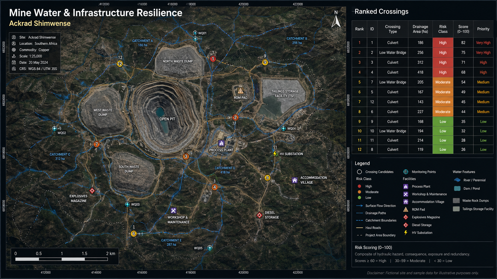
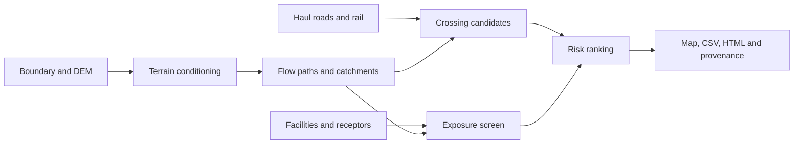

# Mine Water & Infrastructure Resilience — QGIS

**Built by Ackrad Shimwense**

This QGIS plugin helps an engineering team move from “we have a mine boundary and several GIS layers” to a ranked, auditable list of drainage and infrastructure concerns. It combines terrain-derived drainage with haul roads, crossings, facilities, receptors and user-controlled consequence scores.



*The map above uses a fictional copper-mine scenario and sample values to demonstrate the intended output.*

## Project summary

| Question | Output from the tool |
|---|---|
| Where does concentrated runoff cross a haul road or access road? | Crossing candidate layer and ranked CSV |
| Which facilities are close to drainage paths? | Buffered facility-exposure layer |
| Which catchments may produce the largest screening runoff volumes? | Catchment table with area and scenario volume |
| Which locations should be inspected first? | Transparent weighted score and risk band |
| Can another engineer reproduce the screen? | Parameters, source provenance, methodology JSON and manifest |

## Business and engineering purpose

Unplanned water interaction can disrupt haulage, damage crossings, isolate facilities, mobilize sediment and increase operational risk. The expensive mistake is not only a failed culvert; it is sending limited inspection and maintenance resources to the wrong places.

This tool supports copper, gold, cobalt, lithium and other surface-mining operations, owner’s engineering teams, environmental groups, EPC/EPCM consultants and infrastructure planners. It is designed for early screening and prioritization—not final flood routing, TSF design or regulatory certification.

## The solution

The plugin extends the global PreHydro engine with mine-specific processing:

- conditioned DEM, hillshade, slope, aspect and flow accumulation;
- DEM-derived drainage paths and catchment polygons;
- road/rail drainage intersections;
- drainage area and slope sampling at each crossing;
- facility proximity to drainage;
- monitoring point and receptor preservation;
- runoff-volume scenarios using engineer-entered rainfall and coefficient;
- weighted hazard, terrain and criticality scoring;
- ranked CSVs, GeoPackage layers, HTML report and JSON methodology.

## How it works



## Engineering logic in the code

### Inspectable weighted risk score

```python
def weighted_risk_score(hazard, terrain, criticality,
                        hazard_weight=0.50,
                        terrain_weight=0.20,
                        criticality_weight=0.30):
    values = [
        validate_score(hazard, "hazard"),
        validate_score(terrain, "terrain"),
        validate_score(criticality, "criticality"),
    ]
    weights = [hazard_weight, terrain_weight, criticality_weight]
    if any(weight < 0 for weight in weights) or sum(weights) <= 0:
        raise ValueError("Risk weights must have a positive total")
    return round(20.0 * sum(v * w for v, w in zip(values, weights)) / sum(weights), 2)
```

The score is intentionally simple enough to audit. A mine can change the weights and breaks to match its own consequence framework.

### Screening runoff volume

```python
def runoff_screening_volume(area_hectares, rainfall_mm, runoff_coefficient):
    if area_hectares < 0 or rainfall_mm < 0:
        raise ValueError("Area and rainfall must be non-negative")
    if not 0 <= runoff_coefficient <= 1:
        raise ValueError("Runoff coefficient must be between 0 and 1")

    area_m2 = area_hectares * 10_000.0
    rainfall_m = rainfall_mm / 1_000.0
    return round(area_m2 * rainfall_m * runoff_coefficient, 3)
```

Rainfall and coefficient default to zero so the plugin cannot quietly invent a design event.

### Explicit risk bands

```python
def risk_band(score):
    if score >= 80:
        return "CRITICAL"
    if score >= 60:
        return "HIGH"
    if score >= 40:
        return "MODERATE"
    return "LOW"
```

## Technology used

- QGIS Processing plugin API
- Python and GDAL/GRASS hydrology tools
- Copernicus DEM, ESA WorldCover, OpenStreetMap and SoilGrids acquisition options
- GeoPackage and GeoTIFF spatial outputs
- CSV ranking tables, HTML reporting and JSON provenance
- Modular scoring functions with unit tests outside QGIS
- Release ZIP builder for repeatable installation

## Install and run

```powershell
python tools/build_release.py
```

Install the resulting ZIP using **QGIS > Plugins > Manage and Install Plugins > Install from ZIP**. In the Processing Toolbox, open **Mine Water & Infrastructure Resilience**, run Preflight, and then run **Complete Screening**.

Minimum inputs are a polygon boundary, writable output folder and unique run name. A reviewed DEM, roads, facilities and hazard layers should be supplied for operational decisions. Automatic public sources are intended for first-pass screening.

## Output package

```text
03_Mine_Resilience/
├── Mine_Resilience_Results.gpkg
├── Tables/
│   ├── ranked_crossings.csv
│   └── catchment_screening.csv
├── MINE_RESILIENCE_SCREENING_REPORT.html
├── ENGINEERING_METHODOLOGY.json
└── MINE_RESILIENCE_MANIFEST.json
```

The GeoPackage holds the spatial evidence. The CSVs support review and prioritization. The methodology file records weights, breaks and scenario assumptions so a later reviewer can understand the ranking.

## Verification

```powershell
python -m unittest discover -s tests -v
python tools/build_release.py
```

The repository currently passes **13 automated tests** covering acquisition behavior, risk calculations, runoff volume, output writing and release structure.

## What I would build next

- Add culvert capacity and overtopping checks using surveyed dimensions.
- Add inspection history and maintenance cost to the ranking model.
- Compare wet-season satellite observations against predicted drainage paths.
- Add sediment-source and erosion susceptibility screening.
- Add scenario comparison for climate-adjusted rainfall.
- Create a mobile field-inspection export with photos and condition ratings.
- Connect ranked actions to a work-order or asset-management system.

## Engineering boundary

The output is a screening product. Final decisions require verified survey, mine water balance, approved rainfall, calibrated hydrologic/hydraulic models, field inspection, geotechnical and environmental context, and sign-off by the responsible engineers.

